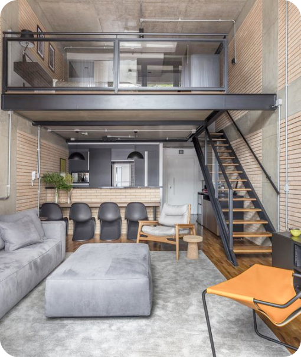

# Projeto arquitetura

Site de captura de possíveis novos clientes para uma empresa de arquitetura, foi utilizado html, css e javascript, integrados ao Google Sheets o qual armazena em uma planilha os e-mails de clientes para um contato posterior por parte da empresa.

## Índice
- <a href="#funcionalidades">funcionalidades do projeto</a> 
- <a href="#demonstração">Demonstração</a> 
- <a href="#tecnologia">Tecnologia utilizadas</a> 
 
 
## funcionalidades do projeto

-[x] Cadasrto de usuário

-[x] Cadasrto de endereço

## Demonstração
Link do site disponibilizado: https://rainbow-arithmetic-d97374.netlify.app

Link da planilha de registro de informação: https://api.sheetmonkey.io/form/kTxB7patMHxtvbXF21YH9S 

## Tecnologia utilizadas
1. HTML5
2. CSS3
3. Javascript
